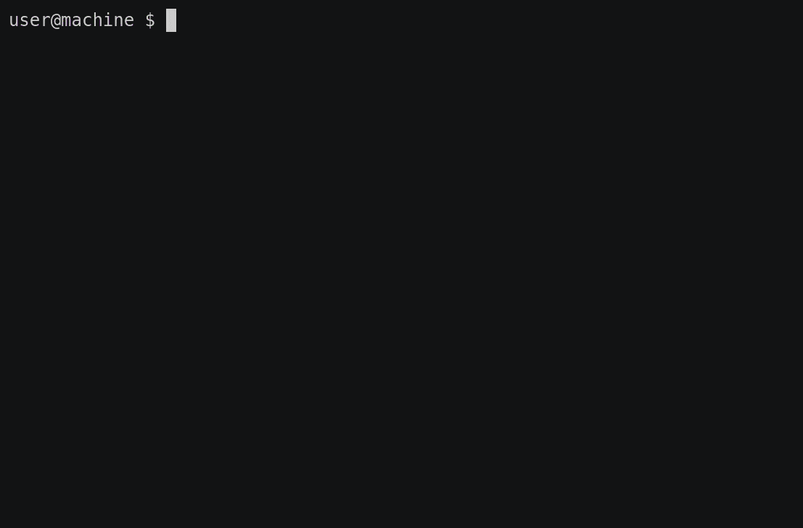

# rmatrix
Generates a 'Matrix'-like screen of falling characters in your terminal

The original [`cmatrix`](https://github.com/abishekvashok/cmatrix) was written in C, and crashes when you wildly resize the window.
The rust version is memory-safe, and doesn't crash so easily. Both versions have comparable performance, due to the underlying use of `ncurses`.

## Installation

### cargo
`cargo install r-matrix`

### Arch Linux
`yay -S rmatrix`
