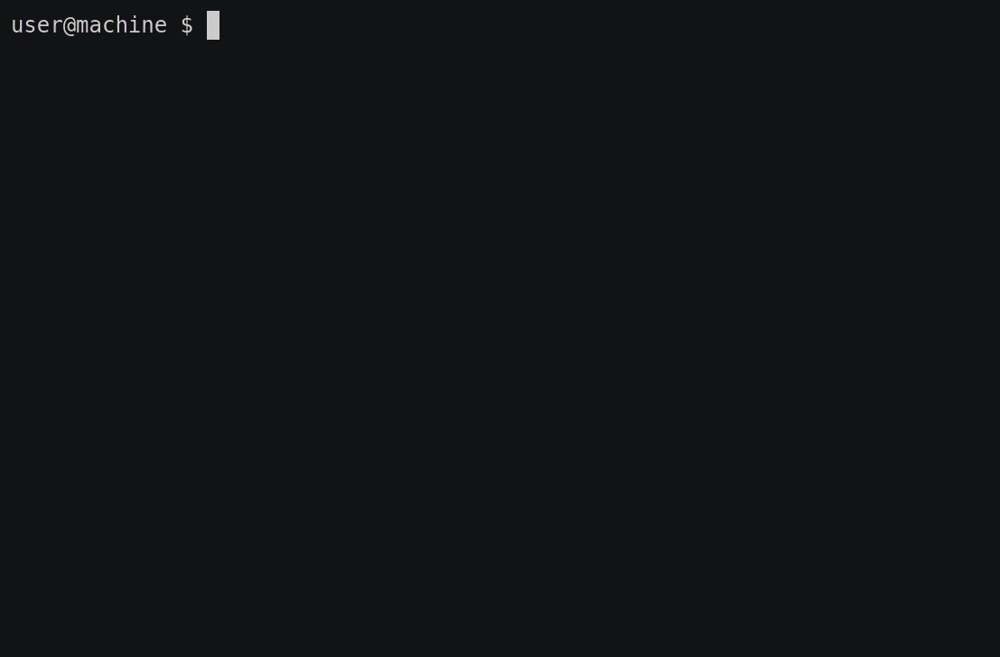

# rmatrix

[](https://github.com/Fierthraix/rmatrix/actions/workflows/ci.yml)
[](https://github.com/Fierthraix/rmatrix/releases)
[](https://crates.io/crates/r-matrix)
[](https://crates.io/crates/r-matrix)
[](https://docs.rs/r-matrix)
[](LICENSE)
[](https://aur.archlinux.org/packages/rmatrix)
[](https://aur.archlinux.org/packages/rmatrix-bin)

Generates a 'Matrix'-like screen of falling characters in your terminal
[](https://asciinema.org/a/IjJyH88BeocsHvJpKJYqvmnuT)

The original [`cmatrix`](https://github.com/abishekvashok/cmatrix) was written in C, and crashes when you wildly resize the window.
The rust version is memory-safe, and doesn't crash so easily.
This version uses `crossterm` for cross-platform terminal support without needing `ncurses` installed.

## Controls
| Key | Control |
| -- | -- |
| 1-9 | Speed the letters fall (1 is fastest, 9 is slowest) |
| Shift + 1-9 | Colour of the characters |
| r | Rainbow mode |

## Installation

### Cargo

```bash
cargo install r-matrix
```

### Arch Linux / AUR

```bash
yay -S rmatrix
yay -S rmatrix-bin
```

### macOS / Homebrew

```zsh
brew install --cask Fierthraix/tap/rmatrix
```

### Windows / Scoop

```powershell
scoop bucket add fierthraix https://github.com/Fierthraix/scoop-bucket
scoop install rmatrix
```

### Nix

```bash
nix profile install github:Fierthraix/nur-packages#rmatrix
```

### Release Assets

```text
https://github.com/Fierthraix/rmatrix/releases/latest
```

## Development

Install the local pre-commit hooks with:

`pre-commit install`

The hooks run `cargo fmt --check`, `cargo clippy --all-targets --all-features -- -D warnings`, and `cargo test --all-targets --all-features`.
GitHub CI runs the same checks on Linux, macOS, and Windows.
